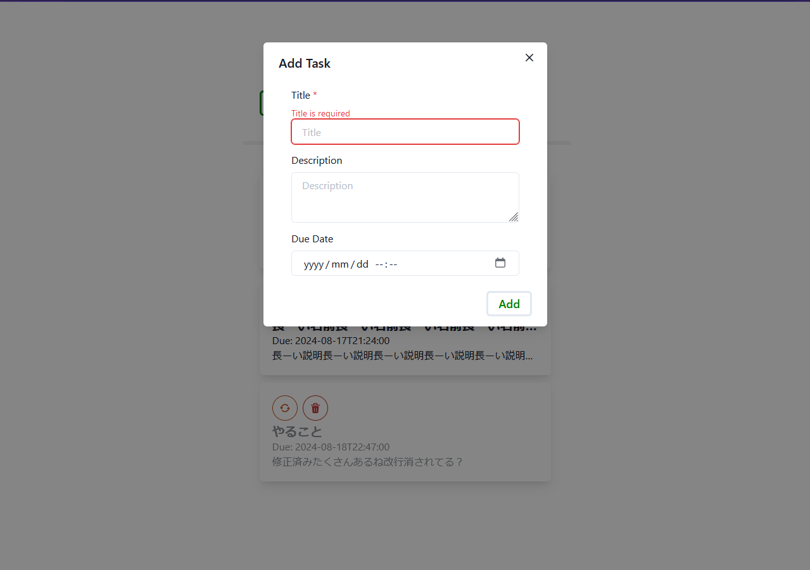
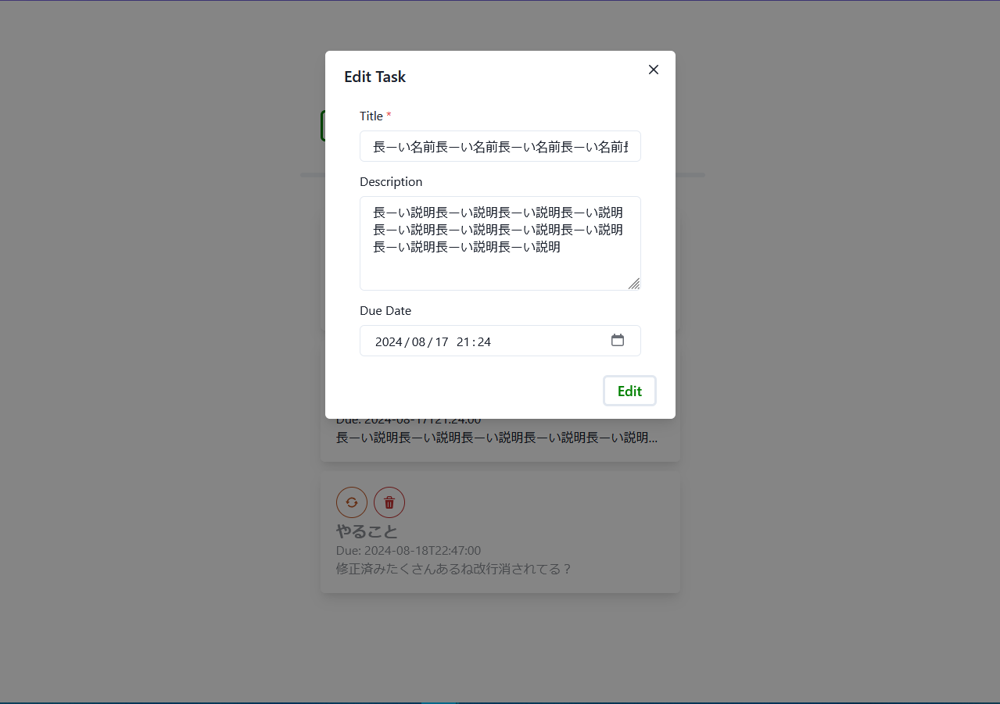
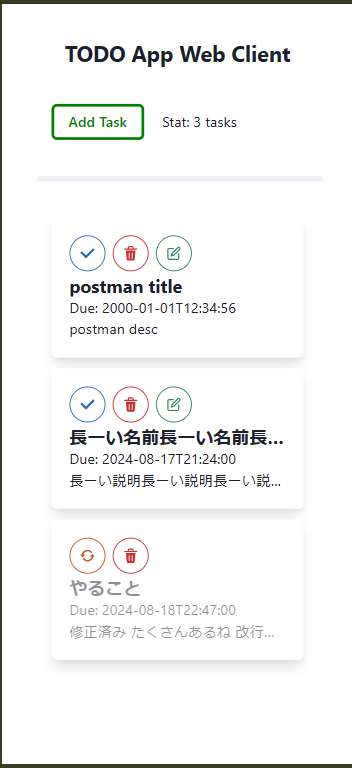
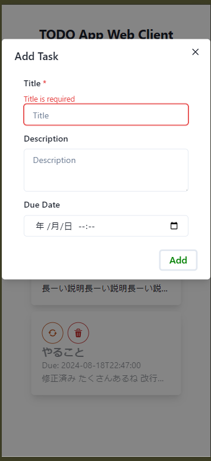
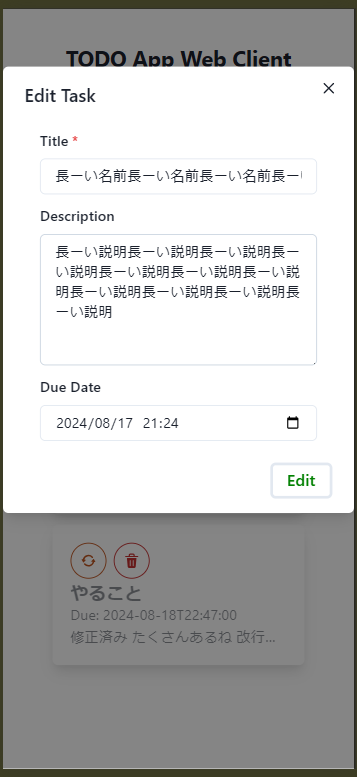

# todo-app-web-client

mattnさんの記事 [（技術アウトプットに自作TODOアプリ）](https://levtech.jp/media/article/column/detail_473/) を読んで，TODOアプリを作ってみた．

今回意識したのは
- 最新の技術を使いたい
- 機能，見た目に拘りすぎない（まずは動くものを作る）
- CSSを書かない（ライブラリに任せる）

開発中のメモは [`NOTE.md`](./docs/NOTE.md)

## Screenshot

<details>
  <summary>Click to expand</summary>
  
  
  
  
  
</details>

## Tech Stack
- NVM (version manager)
- React (ui library)
- Next.js (framework)
- TypeScript (programming language)
- Chakra UI (ui library)
- Eslint (linter)
- Prettier (formatter)
- axios (http client)
- json-server (mock server)

## LOG
```bash
nvm use
npx create-next-app@latest
npm install @chakra-ui/react @chakra-ui/next-js @emotion/react @emotion/styled framer-motion
npm install @chakra-ui/icons
npm install -D prettier json-server
npm run dev
npm run mock
npm run build
npm run start
```

## References
- <https://levtech.jp/media/article/column/detail_473/>
- setup
  - <https://ja.react.dev/learn/start-a-new-react-project>
  - <https://nextjs.org/docs/getting-started/installation>
  - <https://v2.chakra-ui.com/getting-started/nextjs-app-guide>
  - <https://github.com/chakra-ui/chakra-ui>
  - <https://www.typescriptlang.org/>
  - <https://prettier.io/docs/en/configuration.html>
  - <https://github.com/axios/axios>
- dev
  - <https://ja.react.dev/learn>
  - <https://developer.mozilla.org/ja/docs/Web>
  - <https://ja.react.dev/learn/rendering-lists>
  - <https://ja.react.dev/learn/scaling-up-with-reducer-and-context>
  - <https://ja.react.dev/reference/react/StrictMode>
  - <https://ja.react.dev/reference/react/useReducer>
  - <https://ja.react.dev/learn/you-might-not-need-an-effect>
  - <https://ja.react.dev/reference/react/useEffect#fetching-data-with-effects>
  - <https://stackoverflow.com/questions/65876577/usereducer-typescript-on-a-async-maner>
  - <https://fetch.spec.whatwg.org/#cors-protocol>
  - <https://developer.mozilla.org/ja/docs/Web/API/console>
  - <https://zenn.dev/uhyo/articles/useeffect-taught-by-extremist>
  - <https://nextjs.org/docs/app/building-your-application/rendering/client-components>
  - ChatGPT-4o
  - GitHub Copilot
