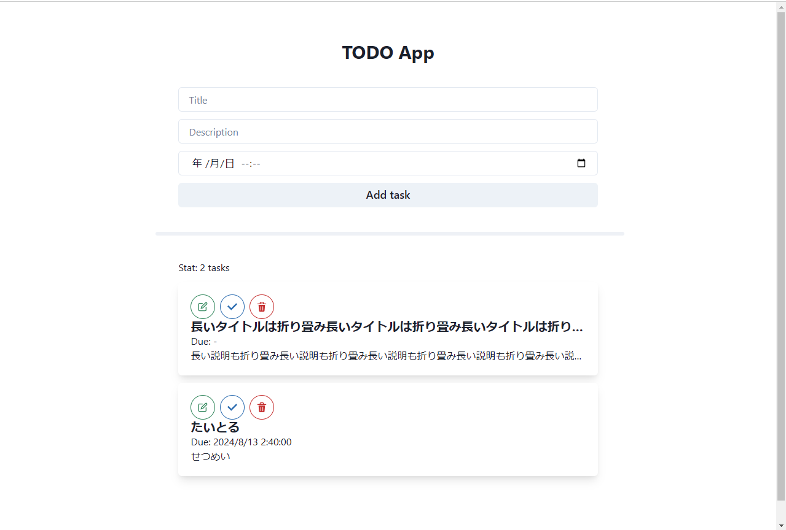

# todo-app-client

mattnさんの記事 [（技術アウトプットに自作TODOアプリ）](https://levtech.jp/media/article/column/detail_473/) を読んで，TODOアプリ（のクライアント側）を作ってみた．フロントエンドの技術をかなり理解できた気がする．次はサーバーサイドもやりたいね．

今回意識したのは
- 最新の技術を使いたい
- 機能に拘りすぎない（まずは動くものを作る）
- CSSを書かない（ライブラリに任せる）

## Screenshot


## Tech Stack
- NVM
- React
- Next.js
- TypeScript
- Chakra UI
- eslint
- prettier
- (Vercel ??)
- json-server

## LOG
```bash
nvm use
npx create-next-app@latest
npm install @chakra-ui/react @chakra-ui/next-js @emotion/react @emotion/styled framer-motion
npm install @chakra-ui/icons
npm install -D prettier json-server
npm run dev
npm run mock
```

## References
- <https://levtech.jp/media/article/column/detail_473/>
- ChatGPT-4o
- GitHub Copilot
- [react | getting started](https://ja.react.dev/learn/start-a-new-react-project)
- [next.js | getting started](https://nextjs.org/docs/getting-started/installation)
- [chakra ui | getting started](https://v2.chakra-ui.com/getting-started/nextjs-app-guide)
- [chakra ui | github](https://github.com/chakra-ui/chakra-ui)
- [typescript | docs](https://www.typescriptlang.org/)
- [prettier | docs](https://prettier.io/docs/en/configuration.html)
- ...
